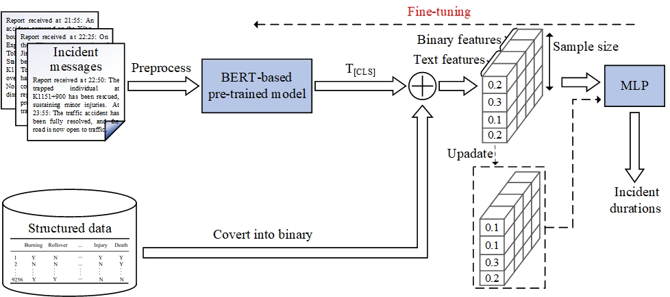
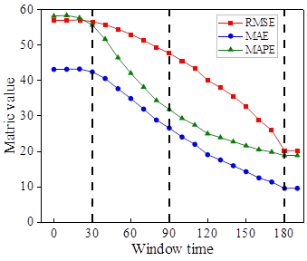
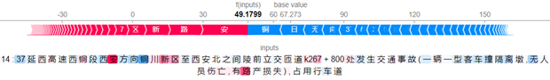

# Incident duration prediction fusing Chinese text: An end-to-end deep learning framework
This is the repository of the paper: "Incident duration prediction fusing Chinese text: An end-to-end deep learning framework"
### Introduction
The text is rich in fine-grained information, and this data is valuable for predicting incident duration. However,traditional text analysis methods frequently suffer from semantic loss, significantly limiting their effectiveness in incident duration modeling.
In view of the above questions, we present a framework that can incorporate BERT-based models to fuse incident messages and structured data for predicting incident duration (see Figure 1).
Specifically, the preprocessed text data is fed into a pre-trained model based on BERT, while the structured data is converted into virtual binary variables. These two types of features are then spliced together. Finally, it is input to MLP and outputs the prediction result of the incident duration.
In our paper, we use the [MiniRBT](https://github.com/iflytek/MiniRBT) model to test our proposed framework.
 
**Figure 1** Proposed end-to-end joint optimization framework
### Data
We use a total of 9256 accident records for the expressways from Shaanxi, China.  Each record is internally created by the Expressway Toll Management Center of Shaanxi Province and consists both structured and textual data.
### One-time prediction
**Table 1** shows the results of MAPE comparison for different frameworks.

| Framework | Initial msg+Binary | Full msg+Binary |
| :---: |:------------------:|:---------------:|
| Two-stage |       50.21        |      45.21      |
| End-to-end |     **45.41**      |    **41.06**    |

**Table 2** shows a comparison of MAPE for different one-time prediction models (partial results).

|    Model     |  Binary   | Initial msg | Full msg  | Initial msg+Binary | Full msg+Binary |
|:------------:|:---------:|:-----------:|:---------:|:------------------:|:---------------:|
|   LDA-SVR    | **67.13** |    62.97    |   60.12   |       62.05        |      59.27      |
| LDA-XGBoost  |   71.59   |    73.06    |   62.83   |       69.73        |      59.82      |
| LDA-LightGBM |   69.46   |    69.99    |   60.90   |       66.08        |      58.08      |
|   LDA-LSTM   |   69.82   |    76.32    |   77.53   |       76.62        |      76.21      |
| MiniRBT-MLP  |   69.82   |  **50.24**  | **41.36** |     **45.41**      |    **41.06**    |
### Sequencial prediction
The results are shown in Figure 2.



**Figure 2** Performance of the MiniRBT-MLP model using full messages and binary data through time. The vertical dotted lines indicate that the time windows are 30 min, 60 min, and 90 min.
### Textual feature evaluation
Three cases of text feature explanation are shown below， and for more detailed explanations, please refer to the html file: "case3.html".




### Implement
1. Install the required packages.
```angular2html
pip install -r requirements.txt
```
2. Download the pretrained model [here](https://github.com/iflytek/MiniRBT).
3. For one-time prediction, run the [LDA+ML.py](https://github.com/dtGaoP/accident_duration_predict/blob/master/LDA%2BML.py) to test the LDA+ML models. 
Run the [LDA+LSTM+MLP](https://github.com/dtGaoP/accident_duration_predict/blob/master/LDA%2BLSTM%2BMLP.py) to test the LDA+LSTM+MLP model.
Run the [MiniRBT+MLP](https://github.com/dtGaoP/accident_duration_predict/blob/master/MiniRBT%2BMLP.py) to test the MiniRBT+MLP model, and the [MiniRBT+MLP+text](https://github.com/dtGaoP/accident_duration_predict/blob/master/MiniRBT_MLP_text.py) to test the MiniRBT+MLP model using only text. 
4. For sequential prediction, run the [MiniRBT_MLP_sequence.py](https://github.com/dtGaoP/accident_duration_predict/blob/master/MiniRBT_MLP_sequence.py) to test the sequencial prediction model.
5. For the feature explanation, run the [LDA+ML.py](https://github.com/dtGaoP/accident_duration_predict/blob/master/LDA%2BML.py) to draw the beeswarm and the PDPs.
6. For the textual feature evaluation, we implement it in a jupyter notebook, see [text_feature_explanation.ipynb](https://github.com/dtGaoP/accident_duration_predict/blob/master/text_feature_explanation.ipynb).
